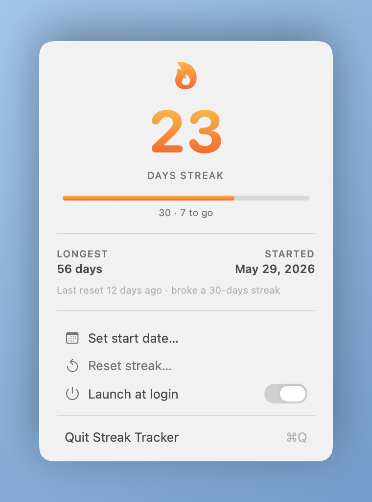
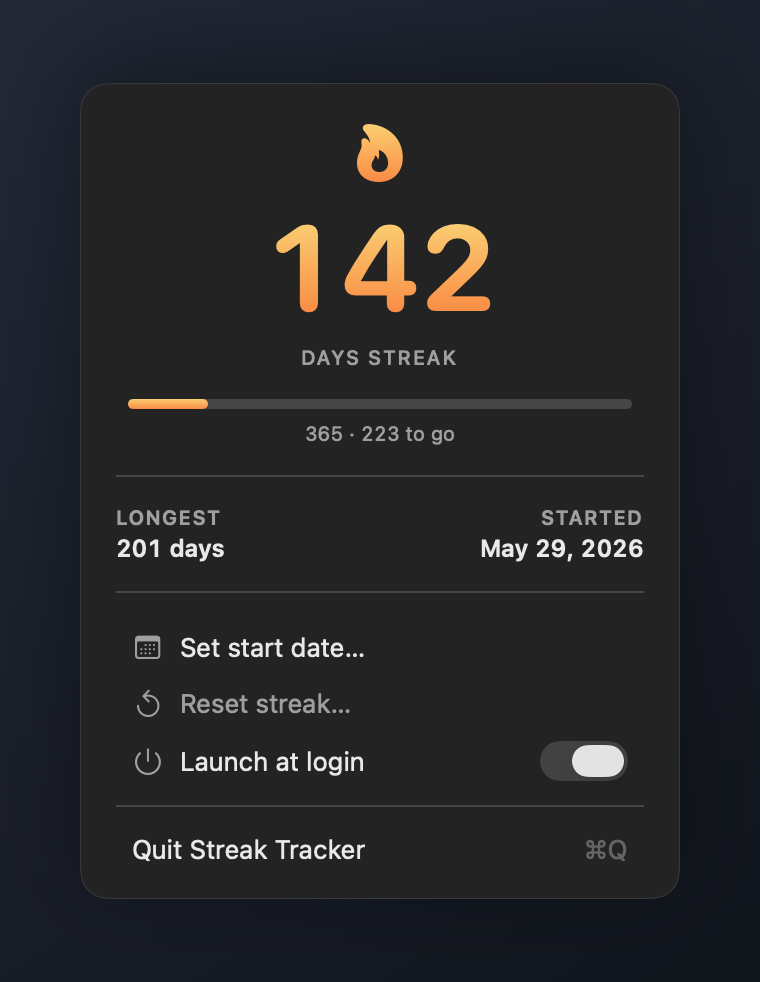

# Streak Tracker

A tiny, native macOS menu bar app that counts the days you've kept something going.
It lives quietly in your menu bar as a flame and a number, and counts up on its own
every day. Broke the streak? One click resets it. That's the whole app.

Track anything you want to do (or not do) every day — exercise, writing, no-spend
days, time without a cigarette, whatever. The app doesn't care what it is; it just
counts.

<p align="center">
  
  
</p>

## Features

- **Counts up automatically** every new calendar day — nothing to click daily.
- **One-tap reset** when you slip, with a confirmation so you can't do it by accident,
  and a same-day **Undo** in case you do.
- **Set a start date** to backdate a streak you're already on.
- **Milestone progress** — the flame strengthens and a bar tracks your run toward
  7, 30, 100, and 365 days.
- **Longest streak** is remembered.
- **Native through and through** — SwiftUI menu bar popover, light & dark mode, your
  system accent color, a monochrome menu-bar glyph that matches Apple's own icons.
- **Launch at login**, menu-bar only (no Dock icon, no window clutter).

## Why it's reliable

The count is never a number that ticks up in the background. The app stores a single
*anchor day* and derives the count from the clock. That means it stays correct even if
the app was closed for days, after a reboot, and across daylight-saving and timezone
changes.

The model is **completed days since the anchor**: the anchor day reads `0`, and each
full calendar day since adds `1`.

- **Start / Set start date** → today reads `0`, then `1` at the next midnight.
- **Reset** → back to `0` today, `1` tomorrow.

Both start and reset land on `0` for "today," so the counter behaves consistently
however a streak begins.

## Install

Requires the Swift toolchain. The Xcode **Command Line Tools** are enough — no full
Xcode needed:

```sh
xcode-select --install   # if you don't already have the tools
git clone https://github.com/saltxd/streak-tracker.git
cd streak-tracker
./build.sh               # builds + assembles StreakTracker.app
cp -R StreakTracker.app /Applications/
open /Applications/StreakTracker.app
```

Then look up at your menu bar. To have it start automatically, open the panel and turn
on **Launch at login** (run it from `/Applications` so the setting sticks).

> The app is ad-hoc signed, so on first launch macOS may ask you to confirm opening it
> (right-click the app → Open, or allow it in System Settings › Privacy & Security).

## Development

```sh
swift build                # debug build
swift run StreakKitCheck   # run the logic checks
```

The streak logic (calendar math, persistence, milestones, undo) lives in a UI-free
`StreakKit` module and is covered by `StreakKitCheck`, a runnable test program. It's a
plain executable rather than an XCTest target because XCTest isn't available with the
Command Line Tools alone.

## Project layout

| Path | Purpose |
|---|---|
| `Sources/StreakKit/DayMath.swift` | Calendar-day arithmetic (pure) |
| `Sources/StreakKit/StreakStore.swift` | Persistence + derived streak values, undo |
| `Sources/StreakKit/StreakTier.swift` | Milestone thresholds (7/30/100/365), pure |
| `Sources/StreakKit/Milestone.swift` | Progress toward the next milestone (pure) |
| `Sources/StreakKit/ResetRecord.swift` | One past streak (date + length) |
| `Sources/StreakTracker/StreakTrackerApp.swift` | App entry, midnight timer, wake observer |
| `Sources/StreakTracker/StreakPanel.swift` | The menu bar popover UI |
| `Sources/StreakTracker/MenuBarIcon.swift` | The monochrome menu-bar flame + number |
| `Sources/StreakTracker/StartDatePicker.swift` | "Set start date" calendar dialog |
| `Sources/StreakTracker/LoginItem.swift` | Launch-at-login toggle (`SMAppService`) |
| `Sources/StreakKitCheck/main.swift` | Runnable logic checks |
| `Tools/generate-icon.swift` | Regenerates the app icon artwork |
| `build.sh` | Builds + bundles the `.app` |

## License

MIT — see [LICENSE](LICENSE).
